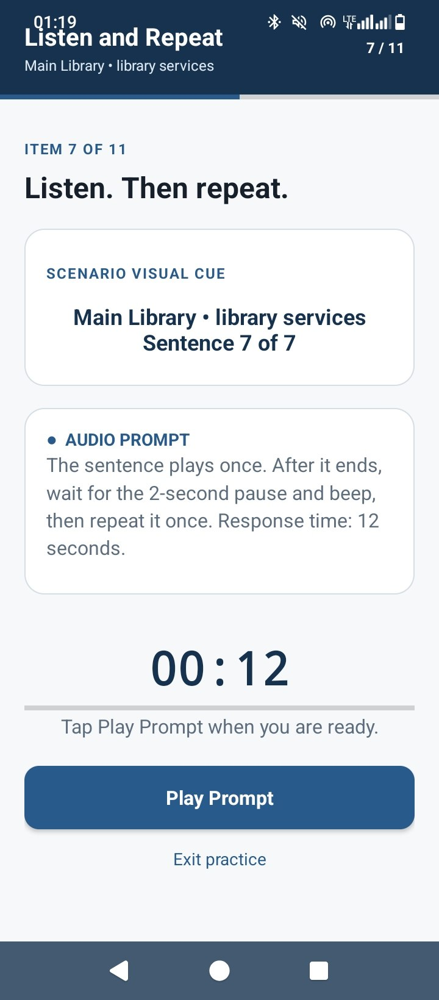
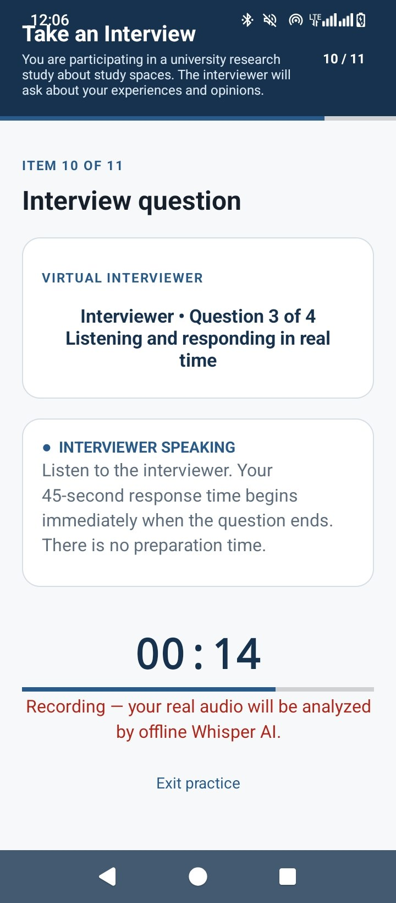
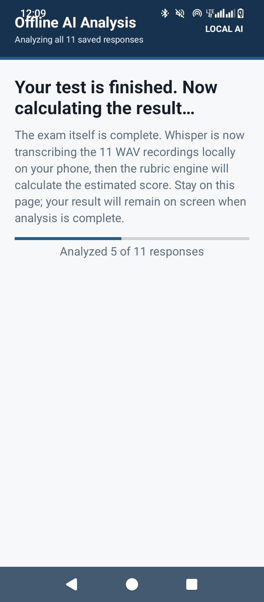
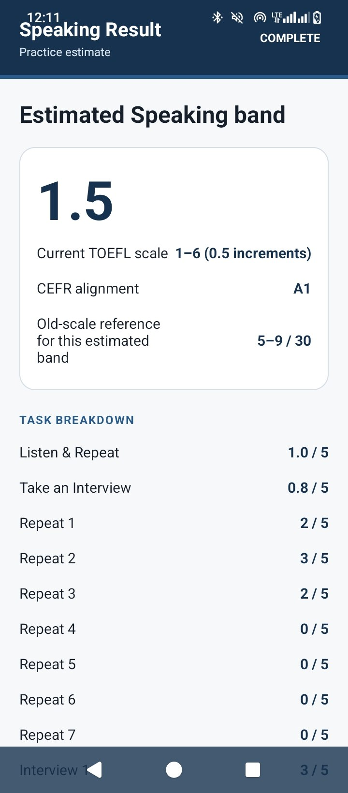
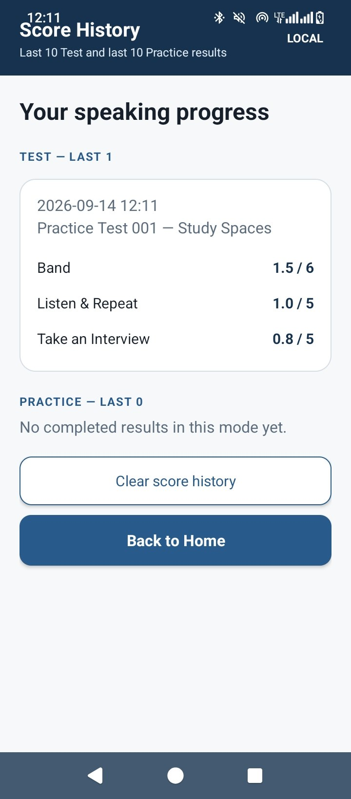

# TOEFL Speaking Practice — Android

A portfolio showcase for an Android speaking-practice application designed around the updated TOEFL-style speaking workflow, with timed tasks, Test and Practice modes, local score history, and on-device AI-assisted analysis.

> **Independent project:** this application is not produced, endorsed, sponsored, or audited by ETS.

  

<strong>Signed Android release · v2.6.3 · direct APK download</strong>

## For reviewers

This repository is the public-facing project portfolio for **Shima Atabaki**. It is intended for faculty, admissions reviewers, recruiters, and collaborators who want to quickly understand the product, its scope, and the development work behind it.

**What this project demonstrates:** product ideation, requirement definition, UX/workflow design, edge-case testing, scoring-logic validation, quality assurance, and AI-assisted software development for a working Android application.

**Current release line:** `v2.6.3`

**Production source:** intentionally maintained in a separate **private repository**. This public repository does not expose the production codebase, signing material, local configuration, or credentials.

## Project overview

The application was conceived as a practical speaking-training tool rather than a static question bank. The focus is on reproducing the flow and time pressure of a speaking session while still giving the learner a separate Practice environment for repetition, feedback, and progress tracking.

The current build includes complete practice tests, a Listen & Repeat section, a Take an Interview section, timed recording, local result storage, score breakdowns, CEFR-oriented feedback, and offline transcription/analysis using an on-device Whisper workflow.

## Screenshots

### Home and format overview

  

### Test and Practice modes

  

## App flow

### Listen & Repeat

  

The learner hears a prompt, waits for the timed response window, and records a real spoken answer under test-style timing.

### Take an Interview

  

Interview-style prompts are presented in sequence with immediate timed responses and no preparation interval for the shown item.

### Offline AI analysis

  

Saved WAV responses are transcribed locally using an on-device Whisper workflow before the app generates a non-official practice estimate.

### Results and task breakdown

  

The result view presents an estimated speaking band, CEFR-oriented reference, legacy-scale reference, and task-level breakdown.

### Score history

  

Recent Test and Practice results are stored locally so the learner can review previous attempts and track progress over time.

## Key features

- Separate **full test simulation** and **Practice mode**
- **Listen & Repeat** task flow with timed responses
- **Take an Interview** task flow with real-time speaking prompts
- Automatic recording of spoken responses
- **On-device/offline Whisper transcription** for saved responses
- Local analysis workflow without requiring cloud scoring
- Estimated speaking band display
- CEFR-oriented score reference
- Item-level task breakdown
- Local score history for recent Test and Practice sessions
- Session-oriented progress and attempt tracking
- 100 complete practice tests with original practice prompts/questions

## Why the project is different

The app is designed around a complete interaction loop:

1. The learner selects a full test or practice session.
2. The application presents timed speaking tasks.
3. The learner records real responses under time pressure.
4. Saved audio is transcribed locally.
5. A rubric-oriented scoring workflow generates a non-official practice estimate.
6. Results are stored locally so progress can be reviewed later.

This makes the project closer to a functional speaking-assessment simulator than a simple question bank.

## Offline AI workflow

A central design decision was to keep speech analysis local where practical. The application records the learner's real audio, transcribes saved responses using an on-device Whisper workflow, and combines transcript-related information with timing, pause, and audio-delivery signals to generate a non-official practice estimate.

The scoring system does **not** reproduce ETS's proprietary scoring system and should not be interpreted as an official TOEFL score predictor.

## Release integrity

The current signed Android release build is prepared as **v2.6.3**. A SHA-256 checksum is maintained in [`CHECKSUMS.txt`](CHECKSUMS.txt) so an installable build can be verified after download.

Release builds are distributed separately from the source repository. Production signing keys and passwords are never stored in this public repository.

## Development approach

The product concept, feature requirements, user-flow decisions, testing priorities, scoring-logic checks, and iterative refinements were directed by **Shima Atabaki**.

AI-assisted development tools were used during implementation, debugging, testing, and refinement. The project therefore represents a combination of:

- Product ideation
- Requirement definition
- UX and workflow design
- Test-case design
- Quality assurance
- Edge-case debugging
- AI-assisted software development

## Technology

- Android
- Android Studio
- Native Android application workflow
- Local audio recording
- On-device Whisper-based transcription
- Local result/history storage
- AI-assisted development and debugging workflow

## Source and security model

The **production source code is intentionally private**. This public repository is maintained as a portfolio and product showcase rather than as a source-code distribution repository.

The private source repository excludes local machine configuration, build outputs, signing keystores, signing credentials, API keys, access tokens, and other secrets. The signing keystore used for release builds is stored separately from both repositories.

## Project status

Active development and refinement.

Current work focuses on usability, scoring consistency, task-flow accuracy, stability, and preparation for broader distribution.

## Author

**Shima Atabaki**

Product concept, requirements, UX direction, testing, validation, and development coordination.

---

### Trademark notice

TOEFL is a trademark of ETS. This independent project is not affiliated with, endorsed by, or sponsored by ETS.
